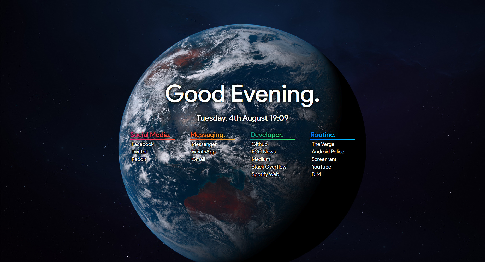
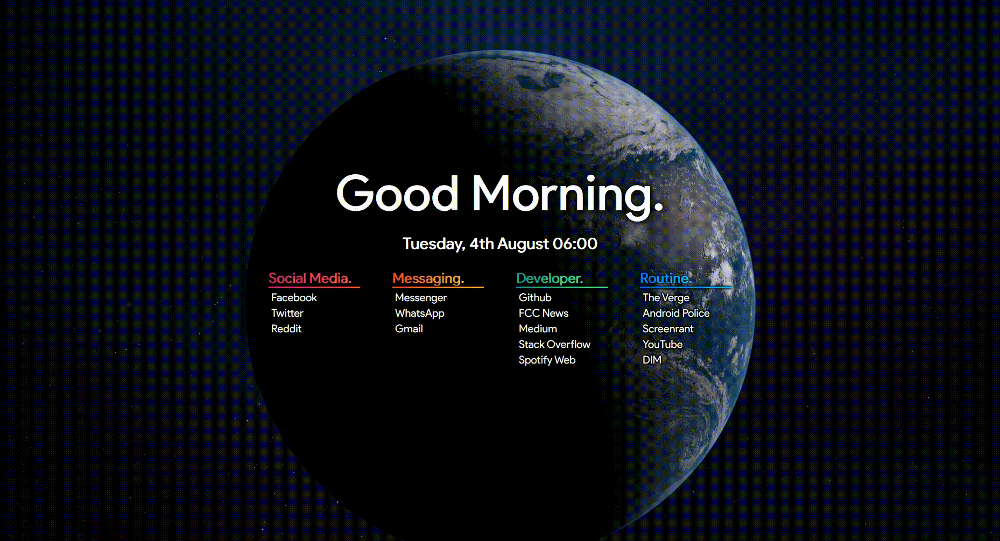
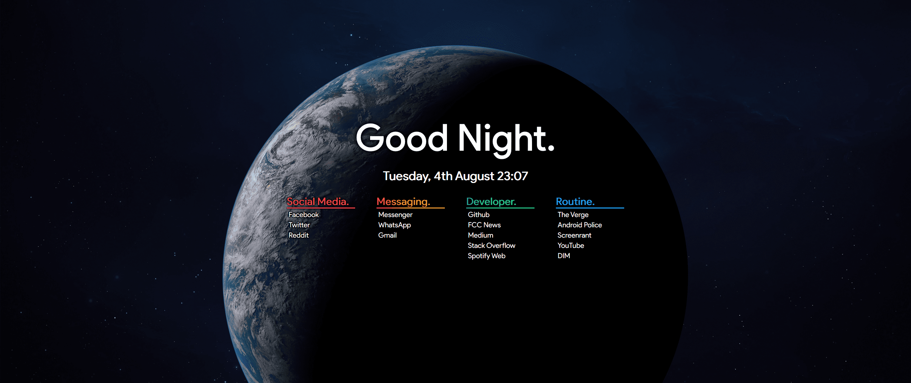

## About The Project

Startpage for your favorites links with a dynamic background. The images and the greeting text change according to the current time.
You can also use other dynamic wallpapers.

[Live Demo](https://jkoenen2.github.io/DynamicStartpage/)

## Screenshots

Ultrawide also works

## Getting Started

* Download all files except the doc Folder
* Change the links and captions in index.html to your desire
* set index.html as the startpage in your browser
  * [Guide for Firefox](https://stpg.tk/guides/firefox-startpage)
  * [Guide for Chrome](https://stpg.tk/guides/chrome-startpage)

## Acknowledgements
* [Background System](https://github.com/Yaindrop/DynamicWallpaper)
* [Wallpaper](https://dynamicwallpaper.club/wallpaper/hqzkn6nai0f)
* [Layout](https://github.com/anton25360/Startpage-live)
